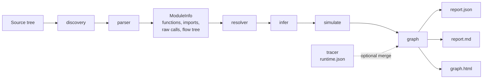
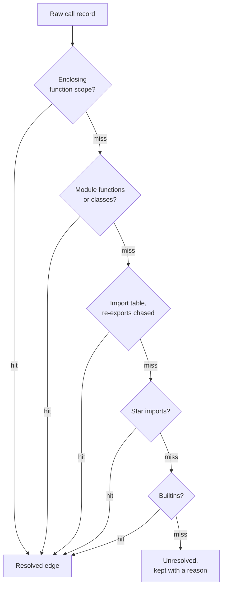
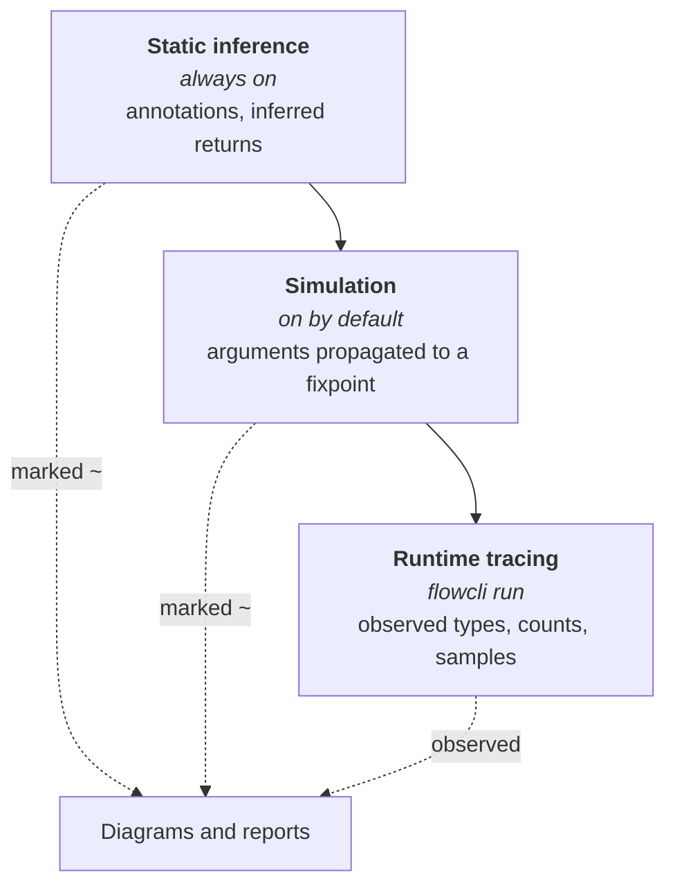

# flowcli

[](https://www.python.org/)
[](https://docs.python.org/3/library/ast.html)
[](https://docs.astral.sh/uv/)
[](https://docs.astral.sh/ruff/)
[](https://mypy-lang.org/)
 
[](https://docs.pytest.org/)
[](LICENSE)

A static call-graph mapper for Python codebases. You point it at a directory or a single file, and
every `.py` below it is parsed through `ast`, callers are matched to callees, and three artifacts
are written: a machine-readable report, a Markdown report, and a self-contained interactive
force-directed graph.
<br><br>Collapsed view of nodes :<br><br>


<br><br>Last 5 calls with simulated debugger:<br><br>


<br><br>Top down view:<br><br>


<br><br>Class with inner class:<br><br>

<br><br>

We ship v1 as static analysis only, with zero runtime dependencies and pure standard library. The
data model reserves a `dynamic` slot on every node, which the v2 profiler merge fills with cProfile
timings and flame-graph data.

## What It Does

Use this tool to read a codebase you did not write, to find what a function actually reaches before
you change it, and to step through execution paths on code that only runs on a device you do not
have in front of you.

Use a debugger or a profiler for questions about one specific live process. This tool models the
code as written, so it answers structural questions rather than reporting the state of a single run.

## How It Works



Two passes are performed, with no AST re-walks.

**1. Parse** (`parser.py`). One visitor walk per file builds a `ModuleInfo`: functions and classes
with qualified names, a module-wide import table with relative imports resolved to absolute dotted
paths, and raw call records classified as `NAME`, `DOTTED`, `SELF_ATTR`, `CLS_ATTR`, `SUPER_ATTR` or
`OPAQUE`. Each function also gets a nested control-flow tree (`flow` in `report.json`) covering
statements, branches, loops, try/except and match, capped at 200 nodes per function. The resolver's
per-line call targets are attached to flow nodes, so diagrams can link to callees.

**2. Resolve** (`resolver.py`). Each raw call is resolved against the project-wide index in a fixed
order.



`ClassName()` targets the defining class's `__init__`, walking parsed bases. `self.x()`, `cls.x()`
and `super().x()` are resolved through an MRO-lite hierarchy walk, depth-first left-to-right and
cycle-guarded. This is not full C3, so diamond hierarchies follow DFS order.

Method calls on typed locals are resolved too. Parameter annotations (`gen: Generator`), annotated
assignments (`x: Foo = ...`) and direct constructor assignments (`engine = Engine()`) give a
variable a class, and `gen.build()` is then resolved through that class's parsed hierarchy. The same
works one level into instance attributes: `self.db = DBLayer(...)` in `__init__`, or `db: DBLayer`
on the class or a parsed base, makes `self.db.update()` resolve to `DBLayer.update`. Types that were
never parsed (`p: Path`, `self.conn = sqlite3.connect(...)`) resolve to nothing, so the scope never
leaks into standard-library or third-party internals.

Anything that cannot be resolved is kept, along with a reason.

| Reason | Meaning |
| --- | --- |
| `external` | Standard-library or third-party target |
| `instance-attr` | Call on a value whose type is unknown, for example `obj.run()` |
| `unknown-name` | The name was never bound anywhere visible |
| `opaque` | Call on a call result, a subscript, or a lambda |
| `not-found-in-hierarchy` | Attribute call whose owner class does not define it |

## Quick Start

1. Install the project and its development dependencies.

	```bash
	uv sync
	```

2. Map a package, and let entry points be suggested for you.

	```bash
	uv run flowcli src/mypkg
	```

3. Pass one of the suggested entries back, to scope the report to its call graph.

	```bash
	uv run flowcli src/mypkg cli.py:main
	```

4. Open `MODEL/graph.html` in a browser. No server and no network access are required.

## Install On Your PATH

The steps above run the tool from inside its own checkout. To call `flowcli` from any directory,
install it as a uv tool instead:

```bash
uv tool install --editable ~/projects/flowcli
```

A `flowcli` executable is placed on your PATH, so the `uv run` prefix is no longer needed:

```bash
flowcli src/mypkg cli.py:main
```

We install it editable on purpose, so the command always reflects the checkout. Pull or edit the
source and the installed executable picks the change up, with no reinstall. If `flowcli` is not
found afterwards, run `uv tool update-shell` once and open a new shell. To remove it later, run
`uv tool uninstall flowcli`.

## Usage

You give two things: what to map, and where to start.

```bash
flowcli src/mypkg                        # map it, and get entry points suggested
flowcli src/mypkg comm/                  # start from everything under a folder
flowcli src/mypkg core.py                # start from every function that file defines
flowcli src/mypkg core.py:process        # start from one function
flowcli src/mypkg mypkg.core:process     # dotted entry works too

# several starting points at once, repeated or comma-separated
flowcli src/mypkg comm/client.py:connect comm/event_store.py
flowcli src/mypkg "comm/client.py:connect,comm/event_store.py,core.py:run"
```

The first argument is always the package to parse, so imports and class hierarchies are resolved
across the whole tree. What follows says where to start reading, and scopes the report to those call
graphs.

Each entry may be a **folder** (every function in every module beneath it, subpackages included), a
**file** (every function it defines), a **single function**, or a dotted module or package name. You
may give as many as you like, mixing kinds freely. They all start at depth 0, and the report covers
their combined reach. Leave entries off and detected entry points are suggested instead: console
scripts, `main()` functions, names exported from `__init__`, and functions nothing else calls.
Output lands in `./MODEL`.

```
flowcli PATH [ENTRY] [options]

  -o, --out-dir DIR          output directory (default: ./MODEL)
  --depth N                  include at most N call-hops from the entry
  --keep-unreachable         keep out-of-scope functions (depth-annotated) instead of pruning
  --include-external         materialize stdlib/third-party targets as leaf nodes
  --exclude GLOB             skip matching paths (repeatable, fnmatch syntax)
  --no-simulate              skip the inferred data-flow simulation
  --no-classes               skip the class / data-model view
  --runtime FILE             merge a flowcli-run runtime.json
  --formats json,md,html     comma-separated subset (default: all three)
  -q, --quiet                suppress the terminal summary

flowcli run [options] prog...      trace a real execution, then map it

  prog...                    script.py [args...]  or  -- -m module [args...]
  --root PATH                code root to trace (default: the script's package)
  --no-samples               record observed types only, no value snapshots
  --no-map                   only write runtime.json, skip building the map
```

Packages do not need `__init__.py`. Namespace packages and plain source trees are rooted by walking
up to the nearest `pyproject.toml`, `setup.py` or `src`, so relative imports still resolve.

### Examples

```bash
flowcli src/mypkg                                # full package map + suggested entries
flowcli src/mypkg cli.py:main                    # just main()'s call graph
flowcli src/mypkg cli.py --formats json,html     # the whole file's ecosystem
flowcli src/mypkg core.py:process --depth 3      # three call-hops deep
```

## Outputs

| Artifact | Contents |
| --- | --- |
| `report.json` | Full node list, meta block, and unresolved calls. Carries `schema_version: 1`, and `dynamic: null` on every node, reserved for profiler data. |
| `report.md` | Call-graph table sorted by out-degree, the ten most-called functions, the unreachable list when an entry is given, and an unresolved-call breakdown. |
| `graph.html` | Offline single-file interactive explorer. |

### The HTML Explorer

`graph.html` opens with two separated views.

**Call-graph explorer** (left, force layout). Modules start collapsed as super-nodes, sized by
function count, with aggregated cross-module call edges, which gives you a module dependency view
first. Opening a function is call-scoped: only that function plus the functions it directly uses are
revealed, wherever they live, never whole modules. Calls into still-hidden code point at the module
bubble, labelled with the hidden count, and following a revealed callee surfaces the next hop. Click
a module bubble, or its legend row, to expand all of it explicitly. "Expand all" and "Collapse all"
switch between the flat graph and a clean reset. You can drag nodes, scroll to zoom, drag the
background to pan, hover for details, and double-click to reheat. Module labels fade in with zoom.
When an entry is given, the entry function and its callees start revealed.

**Flow panel** (right, opens on function click). A deterministic flowchart of the function's control
flow is rendered: statements as boxes, `if`, `match` and `try` as branching diamonds with per-branch
labels, loops with back-edges, and returns as terminators. Resolved call sites appear as clickable
`↳ target` chips. Clicking one inlines the callee's flowchart right at the call site, as a dashed
sub-diagram, and inlined diagrams carry their own chips for going deeper. Click the header, or the
chip again, to collapse. Recursion, and inlining beyond 6 levels, is rendered as a marker instead of
nesting forever. Revealed functions stay synced into the graph view, and Esc closes the panel. The
layout is computed rather than simulated, so the same function with the same expansions always
renders the same diagram.

## Data Flow

Three layers are available, in increasing order of truthfulness. The first two need no execution at
all, which matters when the code only runs on a device.



- **Static inference** (always on). Parameters come from annotations. Return types come from the
  annotation when present, and are otherwise inferred from return statements: literals, constructor
  calls (`return Engine()` yields `Engine`), typed locals, and calls to other functions whose return
  type is known, chained through a bounded fixpoint so recursion and cycles stay safe. Inferred
  types are marked `~`. Every signature lands in `report.json`, in a `## Signatures` table in
  `report.md`, and in the diagram's header box, where parameters go in and `returns:` comes out, and
  each `return` box shows what that branch yields.
- **Simulation** (on by default). This is a static stand-in for a debugger session. Every call
  site's arguments are bound to the callee's parameters and propagated across the graph. Literals
  carry their actual value (`fact(5)` gives `n = 5`), names carry their declared type, and nested
  calls carry the callee's return type, iterated to a fixpoint so values travel several hops from
  the entry. Diagrams show `n: int ~ 5`, where `~` marks a simulated value that was never observed,
  and the replay animation walks a simulated call order, depth-first from the entry in source-line
  order. You can therefore step through code that can never run locally. Turn it off with
  `--no-simulate`.
- **Runtime tracing** (`flowcli run`). Your script or module is executed under a `sys.setprofile`
  hook filtered to files under `--root`. Per function, the following is recorded: call count,
  observed argument and return types on every call, truncated `repr()` snapshots of the first five
  calls, and a bounded call-event log of 2000 events. `runtime.json` is merged into the map through
  `--runtime`, or through `run --map`, filling each node's `dynamic` field. Diagrams then show
  `declared | seen` types, call-count badges, and sample values on hover, and the graph gains a
  **▶ Replay** button that animates the recorded call sequence.

```bash
flowcli run --root src/mypkg script.py --arg value
flowcli run --root src/mypkg -- -m mypkg
```

Tracing caveats: the main thread only; an exception unwind is recorded as a `None` return; C
functions and `lru_cache` hits produce no frames; and classes defined in the traced `__main__`
script report `__main__.X` type names.

## Views

The tabs in the top bar switch between two graphs built from the same parse.

- **Call graph**: what runs what, as described above.
- **Classes**: what holds what, meaning the data model. Each class is a card listing its properties
  (`value: float`, `unit: Unit`) and public methods, tagged with a stereotype where one applies
  (`«enum»`, `«dataclass»`, `«struct»`, `«abstract»`). Solid edges are has-a relations, labelled with
  the property name, so a `Measurement` whose `unit` is a `Unit` draws an edge labelled `unit`. Green
  dashed edges are inheritance, so a `Unit(StrEnum)` shows its base. Bases outside the parsed tree,
  such as `StrEnum` itself, are listed on the card but are not nodes. Properties come from
  class-level annotations, dataclass fields, and `self.x = ...` in `__init__`.

  Clicking a class opens a structure panel on the right, the data-model counterpart of the flow
  diagram. It lists the class's properties, and any property whose type is another class carries a
  `▸` you can click to expand that class inline, nested inside the parent, as deep as the model
  goes. Recursive types are marked instead of unrolled, and nesting stops at 6 levels. A
  `Measurement` opens to reveal `unit: Unit`, which opens in place to reveal `MM` and `CM`. Clicking
  a method row jumps to that method's flow diagram in the call view. `--no-classes` skips the whole
  view, and `report.json` gains a `classes` block plus a `## Classes` table in `report.md`.

Further modes apply across the views.

- **Trace focus**: opening any function's diagram reduces the left graph to just the traced system,
  meaning the function, its callers (faded) and its callees, growing as you inline deeper calls. Esc
  restores the full explorer, and the `☰` button brings the module tree back while focused.
- **Top-down**: a deterministic layered layout, with entry points (nothing visible calls them) on
  top and calls flowing downward, for reading start-to-end paths. It toggles with the force layout.
- **Step debugger**: the bar at the bottom walks the call sequence one call at a time. You can play
  at an adjustable pace, or step with the arrows (`←` and `→`, space to play or pause). Each step
  names the call being made and the arguments flowing into it (`main → helper(n=5)`), and reveals
  nodes as they are first reached. The last five calls stay lit, brightest for the most recent and
  fading with age, on both the graph edges and the cards, with the same trail listed above the bar,
  so you see the path that got you here rather than only the current hop. Stepping backward
  re-derives the trail, so it is always correct. The sequence is the traced call order when runtime
  data exists, and the simulated one otherwise.
- **Animations**: `⇉` in the panel head marches the flow-diagram edges in call direction, and
  respects `prefers-reduced-motion`.

## Project Layout

```text
flowcli/
├── src/flowcli/
│   ├── discovery.py       # Walk a source tree, find the modules to parse
│   ├── parser.py          # One AST visit per file, builds ModuleInfo + flow trees
│   ├── resolver.py        # Match raw call records to definitions project-wide
│   ├── infer.py           # Signature and return-type inference to a fixpoint
│   ├── classes.py         # Class cards, properties, inheritance edges
│   ├── entrypoints.py     # Detect console scripts, main(), exports, unreferenced funcs
│   ├── simulate.py        # Propagate call-site arguments across the graph
│   ├── tracer.py          # sys.setprofile runtime capture for flowcli run
│   ├── graph.py           # Assemble nodes and edges, prune by depth
│   ├── models.py          # Shared data model
│   ├── report.py          # report.json and report.md writers
│   ├── render_html.py     # Data injection into the standalone page
│   ├── template_html.py   # The offline explorer itself
│   └── cli.py             # Argument parsing and command wiring
├── tests/                 # Unit tests, plus fixture projects under tests/fixtures
└── pyproject.toml
```

`MODEL/` is the default output directory and is ignored by Git, along with `.venv/`, caches and
build artifacts.

## Modify The Tool

| What to change | Location |
| --- | --- |
| Command-line surface and flags | `src/flowcli/cli.py` |
| What counts as a call, and flow-tree shape | `src/flowcli/parser.py` |
| Call resolution rules and hierarchy walking | `src/flowcli/resolver.py` |
| Type inference | `src/flowcli/infer.py` |
| Argument propagation | `src/flowcli/simulate.py` |
| Report contents | `src/flowcli/report.py` |
| Explorer behaviour and rendering | `src/flowcli/template_html.py` |
| Tests and fixture projects | `tests/` |

To add a resolution rule, extend the ordered lookup in `resolver.py`, give the failure case a named
reason rather than a silent drop, and add a fixture under `tests/fixtures/` that exercises it.

## Development

```bash
uv sync           # create venv + install (editable) + dev deps
uv run pytest     # test suite
uv run ruff check && uv run ruff format --check
uv run mypy
```

Dogfood it on itself:

```bash
uv run flowcli src/flowcli src/flowcli/cli.py:main -o /tmp/self
```

### Verification Commands

Run these before committing:

```bash
uv run pytest -q
uv run ruff check
uv run mypy
git diff --check
git status --short
```

## Naming Scheme

- Node ids are `dotted.module:qualname`, for example `pkg.models:Engine.start`. External targets are
  plain dotted paths such as `os.path.join`, and the missing `:` is the internal versus external
  discriminator.
- Nested functions are named `outer.inner`, with no `<locals>`. Name collisions get a `#<lineno>`
  suffix.
- Import-time code, meaning top-level calls, decorator applications and class-body statements, is
  attributed to a synthetic `module:<module>` node, created only when needed. Scripts therefore work
  as entry targets, and decorator edges live where they actually execute.

## Known v1 Limitations

These are deliberate. Guessing here would produce edges that look authoritative and are wrong.

- Assignment aliasing (`f = g; f()`), `getattr`, containers of callables, and dynamic dispatch
  beyond the parsed class hierarchy are not followed. Type inference covers annotations and direct
  constructor assignments only, so `x = get_engine(); x.run()` stays unresolved unless `x` is
  annotated.
- Function-local imports are treated module-wide, and the last write wins.
- `self.x()` is resolved only within the enclosing class's own hierarchy, never downward to
  subclasses. That is dynamic dispatch, and it is flagged `not-found-in-hierarchy` instead of being
  guessed.
- The HTML layout is O(n²) per frame. A warning is printed above 3000 nodes.

## License

This project is licensed under the [MIT License](LICENSE).
